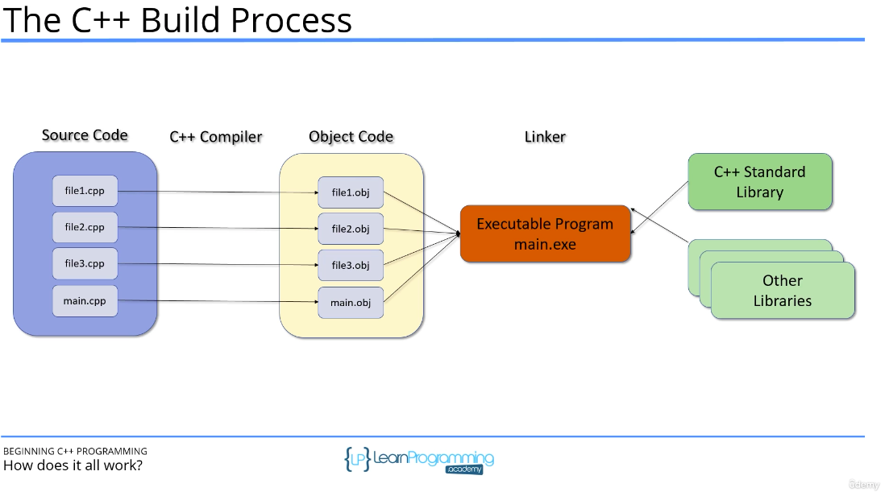

## Curriculumn Overview

- Structure of a C++ Program  
- Vairables and Constants
- Arrays and Vectors 
- Strings in C++
- Expressions, Statements and Operators
- Statements and Operators
- Determining Control Flow
- Functions
- Pointers and References
- OOP - Classes and Objects
- Operator Overloading 
- Inheritance
- Polymorphism
- Smart Pointers
- The Standard Template Library (STL)
- I/O Streams
- Exception Handling 

## Running vscode with c++
https://www.youtube.com/watch?v=Q5sI2ELKrh0

- Compiler Errors
- Compiler Warnings
- Linker Errors
- RunTime erros

## Structure of a C++ Program
