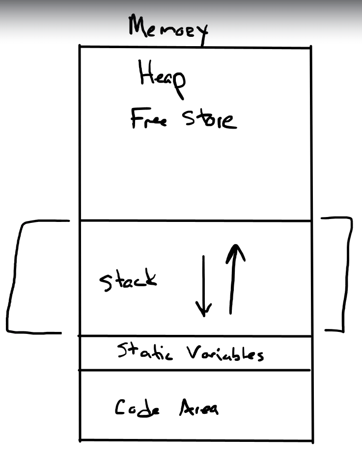

## Functions

### Overview
- defintion
- prototype
- Parameters and pass-by-value
- return Statement
- default parameter values
- overloading
- passing arrays to function 
- pass-by-reference
- inline functions
- auto return type
- recursive functions

### What is a function 
```cpp
int add_numbers (int a, int b)
{
    return a + b;
}

cout << add_numbers(20,40);
```

### Functions Defintion
```cpp
int getNumber(){
    return 5;
}

void printNTimes(int n , string text){
    for (int i =0; i < n; i++){
        cout << text << endl;
    }
}

int main(){
    printNTimes(5, "Tim");
}

// default parmeter
int doMath(int x, int y, int z =1){
    return (x+y)*z
}

// weird return types
pair<int, int> makePair(intx, int y){
    reutnr pair<int,int>(x,y);
}

//pass by reference ( instead of pass by value)
void swap(int &x = 2, int &y = 4){
    swap(a,b);
}

int a {1};
int b {3};
swap(a,b)
```

### Function Prototypes
The compiler must 'know' about a function before it is used
1. Define functions before calling them 
- Ok for small program but not practical for larger programs

2. Use function prototypes 
- Tells the compler what it needs to know without a full function defintion
- also called forward delcarations 
- placed at the beginning of the program
- also used in our own header files (.h) 

```cpp
int function_name(int, std::string); // function_prototype
int function_name(int a, std::string b); // function_prototype, bettter practice with parameter_name

int function_name(int a, std::string b){
    statements(s);
    return 0;
}
```

### Function Parameters and the Return Statement

#### 1. Pass by Value
- When you pass data into a function, it is **passed by value**.
- A **copy** of the data is passed to the function.
- Any changes made to the parameter inside the function **do not affect** the argument that was passed in.

#### 2. Formal vs Actual Parameters

**Formal Parameters**
- These are the variables listed in the **function definition**.
- They act as **placeholders**.
- They do not hold real values until the function is called.

**Actual Parameters**
- These are the **real values** you pass to the function when calling it.

```cpp

void param_test(int formal_param){ 
    formal_param = 100 
    cout<< formal_param;
}
int main(){
    int actual_param {50};
    param_test(actual_param); //acutal_param is copied into formal_param
    cout<<actual_param;
}

```
#### 2. Formal vs Actual Parameters
```
int pass_by_value_1(int a, int b){
    return 
}
int pass_by_reference_1(int a, int b){
    return 
}
int pass_by_pointer_1(int a, int b){
    return 
}
```
### Default Arguement Values
- We can tell compiler to use default values if the arguments are not supplied 
- Defualt Values can be in the prototype or definition , not both
- Best practice is in the prototype
```cpp
double calc_cost(double base_cost , double tax_rate = 0.06);

double calc_cost(double base_cost, double tax_rate){
    return base_cost += (base_cost * tax_rate);
}

int main(){
    double cost {0};
    cost = calc_cost(100.0); // will use default value
    cost = calc_cost (100.0, 0.06);
    return 0;
}
```

### Function Overloading
- we can have functions that have different paramter lists that have the same name
- abstraction mechanism since we can just think 'print' for example
- A type of polymorphism
- Same name work work with different data types to execute similar behaviour
- The compiler must be able to tell the functions apart based on the paramter lists and argument supplied
```cpp
int add_numbers (int, int);
double add_numbers (double , double);
```

### Function templates 
- Templates allow you to write one function that works with many data types.
- They offer a more scalable alternative to manually overloading multiple versions. 
```cpp
// 1. Template with same type
template <typename T>
T add(T a, T b) {
    return a + b;
}

int main() {
    cout << add(3, 4) << endl;        // int
    cout << add(3.5, 2.1) << endl;    // double
}
```
### Passing arrays to functions
- we can pass an array to a function by providing square brackets in the formal paramter description `void print_array(int numbers [])
- the array elements are not copied
- Since the array name evaluates to the location of the array in memory - this address is what is copied
- So the function has no idea how many elements are in the array since all it knows is the location of the first element ( the name of the array)

```cpp
void print_array(int numbers[], size_t size)

int main() {
    int my_numbers[] {1,2,3,4,5};
    print_array(my_numbers);
    return 0;
}

void print_array(int numbers [], size_t size){
    // Doesn't know how many elemnets are in the array???
    // we need to pass in the size!!
    for (size_t i{0}; i < size; ++i){
        cout<< numbers [i] << endl;
    }
}
```

#### Protect Arrays in a Function Using `const` Parameters

To prevent an array from being modified inside a function, we use **const parameters**.

- Adding `const` tells the compiler that the function's parameter is **read-only**.
- This prevents accidental modification of the array.
- This is useful for functions like `print_array()`, which should not change the array's data.

Example:

```cpp
void print_array(const int numbers[], size_t size) {
    for (size_t i {0}; i < size; ++i) {
        cout << numbers[i] << " ";
    }
}
// - const int numbers[] means the function is not allowed to modify any element of the array.
// - Attempting to do something like numbers[0] = 10; will produce a compiler error.
```
### Pass By reference
- sometimes we want to be able to change the actual parameter from within the function body
- In order to achieve this we need the location or address of the actual parameter
- we saw how this is the effect with array, but what about other variable types?
- we can use reference paramters to tell the compiler to pass in a reference to the actual parameter
- the formal parameter will now be an alias for the actual parameter
```cpp
void scale_number(int &a , int &b); // prototype
```
#### vector example - pass by const reference
```cpp
// Most effcient way to pass vector , and we dont pass by value so no data copying ....
// also we prevent function to change the vector.
void print(const std::vector<int> &v){
}
```

### Scope Rules
- C++ uses scope rules to determine where an identifier can be used 
- C++ uses static or lexical scoping
- Local or Block scope
- Global scope

#### Local or Block scope 
1. Declared inside {}

Any identifier (variable, constant, etc.) declared inside a block {} has block scope.
It is only visible inside that block.
```cpp
{
    int x = 10; // x is only visible here
}
cout << x; // ❌ Error: x not visible
```
2. Function parameters have block scope

Function parameters behave like local variables — they belong to the function’s block.
```cpp
void foo(int a) { // 'a' has block scope
    cout << a; 
}
```
3. Lifetime: Only active while the block executes

Local variables are created when the block starts and destroyed when it ends.

```cpp
void bar() {
    int x = 5; // created here
} // x destroyed her
```

4. Not preserved between function calls

Each function call gets a new copy of its local variables.
```cpp
void f() {
    int counter = 0;
    counter++;
    cout << counter;
}

f(); // prints 1
f(); // prints 1 again (NOT 2)
```
Unless you use static (exception).

5. Nested blocks: inner can see outer; outer cannot see inner
This is called scope nesting.

```cpp
int a = 1;

{
    int b = 2;
    cout << a; // ✅ outer visible inside inner block
}

cout << b; // ❌ outer block cannot see inner block variables
```

### Static local variables
- declared with static qualifer
- value is preserved between function calls 
- only initialized the first time the function is called
```cpp
void foo() {
    static int count = 0;
    count++;
    cout << count;
}

foo(); // prints 1
foo(); // prints 2
foo(); // prints 3
```

### How do function calls work
1. Funciton use the 'function call stack'
- Analogous to a stack of books
- LIFO - Last in First Out
- push and pop

2. Stack Frame or Activation Record
- Functions must return control to function that claled it 
- Each time a function is claled we create an new activation record and push it on stack 
- When a fucntion terminates we pop the activation record and return 
- Local variables and function paramters are allocated on teh stack 

3. Stack size is finite- Stack overflow




### What Is an Inline Function?

Normally, when you call a function:

```cpp
int result = add(5, 10);
```
the program must:
1. Push parameters onto the call stack
2. Jump to the function’s location in memory
3. Run the function
4. Return back to the caller
5. Pop the stack frame

This takes time (small but real).
An inline function tells the compiler:
“Instead of doing a normal function call, paste the function body directly at the call site.”

```cpp
inline int add(int a, int b){
    return a + b;
}
```
When compiled this call:
```cpp
int result = add(5,10);

int result =(5+10);
```

### Recursive Functions

```cpp
ReturnType functionName(arguments) {
    // 1. Base Case (stop condition)
    if (/* stopping condition */) {
        return some_value;
    }

    // 2. Recursive Case (break into smaller problem)
    return functionName(smaller_argument);
}

void countdown(int n) {
    if (n == 0) {
        std::cout << "Go!\n";
        return;            // BASE CASE
    }

    std::cout << n << "\n";
    countdown(n - 1);      // RECURSIVE CASE
}
```
