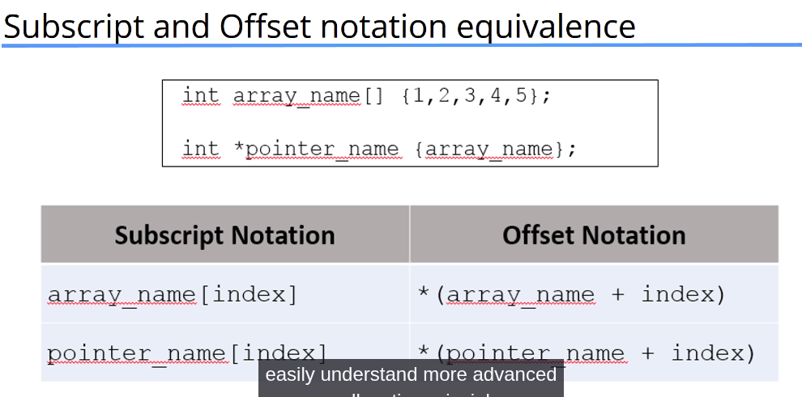
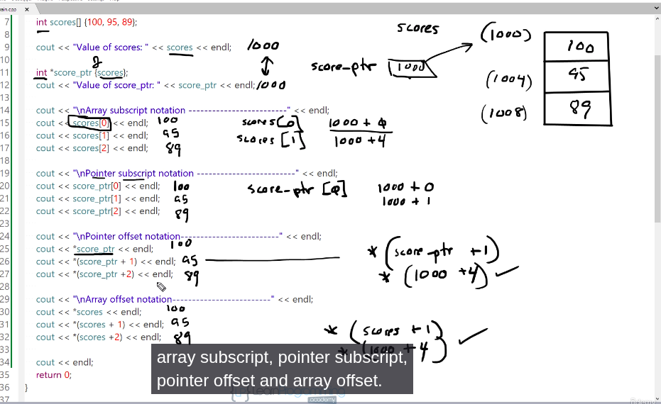
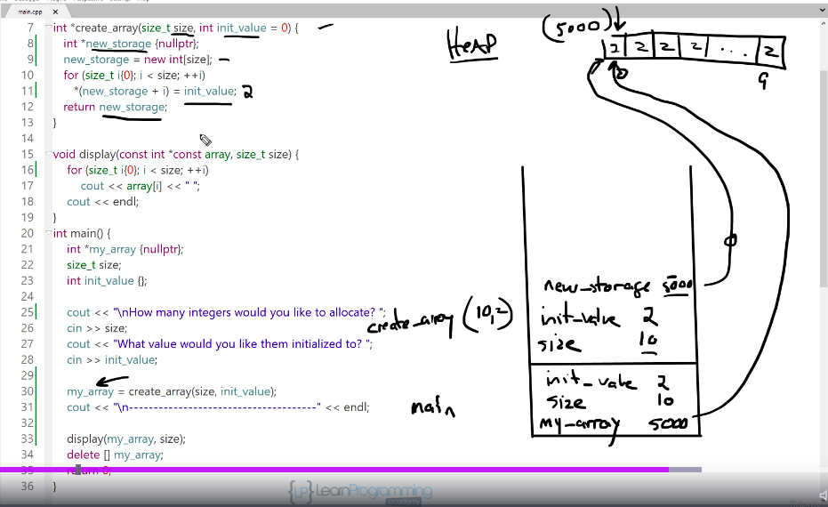

## Pointer and References

### Overview
1. What is a pointers
- Declaring pointers
- Storing addresses in pointers
- Dereferencing pointers
- Dynamic memory allocation
- Pointer arithmetic
- Pointers and arrays
- Pass-by-reference with pointers
- const and pointers
- Using pointers to functions
- Potential pointer pifalls

2. What is a reference?
- Review passing references to functions
- const and references
- Reference variables in range-based for loops
- Potential reference pitfalls
- Raw vs Smart pointers

### 1.1 Declaring Pointers
```cpp
int *p;                 // ❌ Very dangerous — uninitialized
char *c {}              // safe, C++11 value-initialization → nullptr
double *d {nullptr};    // safe
```
Pointers must match the type they point to.

### 1.2 Storing Addresses in Pointers

A pointer stores the memory address of another variable.
To get the address of a variable, use the address-of operator (&).

```cpp
int x {10};
int* p {&x};     // p now holds the address of x 

//--- What happens in memory ----
x = 10
&x = 0x1000 (example address)

p = 0x1000
*p = 10
// p stores the address
// *p dereferences the address (gets the value)
```

### 1.3 Dereferencing a Pointer
Dereferencing a pointer means accessing the value stored at the memory address the pointer holds.

You use the * operator to dereference.

```cpp
int x {10};
int* p {&x};

*p = 20;     // changes x to 20
int* p {&x};

*p = 20;     // changes x to 20
```

### 1.4 Dynamic Memory Allocation 
Allocating Storage from the heap at runtime

- we often dont know how much storage we need until we need it 
- We can allocate storage for a variable at run time 
- Recall C++ arrays
- We had to explicitly provide the size and it was ixed
- but vectors grow and shrink dynamically
- we cna use pointers to access newly allocated heap storage

#### using new to allocate storage 
```cpp
int *int_ptr {nullptr};
int_ptr = new int; //allocate an integer on the heap 
cout << int_ptr << end; // 0x2747f28
cout << *int_ptr << endl; // 41188048 - gargabe
*int_ptr =100
cout << *int_ptr <<endl; //100
```

#### using delete to deallocate storage
```cpp
int *int_ptr {nullptr};
int_ptr = new int; // allocate an interger on the heap
delete int_ptr //frees the allocated storage
```

#### using new[] and delete[] to allocate/deallocate storage for an array
```cpp
int *array_ptr {nullptr};
int size {};

cout<<"How big do you want the array?";
cin>>size;

array_ptr = new int[size]; //allocate array on the heap
// we can access the array here
delete [] array_ptr; //free allocated storage

```
### 1.5 Relationship Between Arrays and Pointers
- The value of an array name is the address of the first element in the array
- The value of a pointer variable is an address
- If the pointer points to the same data type as the array element then the pointer and array name can be used interchangeably ( almost )

```cpp
int scores[] {100,95,89};
cout<< scores <<endl;       //0x61fec8
cout<< *scores <<endl;      //100

int *score_ptr {scores};
cout<<score_ptr<<endl;      //0x61fec8
cout<< *score_ptr<< endl;   //100

// Pointer arithmetic
cout << score_ptr;          //0x61ff10
cout<< (score_ptr+1);       //0x61ff14
cout<< (score_ptr+2);       //0x61ff18

cout<< score_ptr[0] <<endl; //100 , syntactic sugar for *(score_ptr+0)
cout<< score_ptr[1] <<endl; //95 , syntactic sugar for *(score_ptr + 1)
cout<< score_ptr[2] <<endl; //89, syntactic sugar for *(score_ptr + 2)
```




### 1.6 Pointer Arithmetic
1. Pointers can be used in 
- Assignedment expressions
- Arithmetic expressions
- Comparison expressions
2. C++ allows pointer arithmetic
3. Pointer arithmetic only make sesnse with raw arrays

```cpp
// (++) increments a pointer ot point the the next array element
int_ptr++;

// (--) decrements a pointer to point to the previous array element
int_ptr--;

// (+) increment pointer by n * sizeof(type)
int_ptr +=n; or int_ptr = int_ptr +n;
int_ptr = &arr[0];
int_ptr += 2;   // pointer points to arr[2]

// (-) decrement pointer by n*sizeof(type)
int* int_ptr = arr + 5;   // points to arr[5]
int_ptr -= 2;               // popinter point to arr[3]

// Subtracting two pointers
// - Determine the number of elements between the pointers
// - Both pointers must point to the same data type
int n = int_ptr2 - int_ptr1;

// Comparing two pointers == and !=
// Determine if two pointers point to the same location
// Does not compare the data where they point

string s1 {"Frank"};
string s2 {"Frank"};

string *p1 {&s1};
string *p2 {&s2};
string *p3 {&s1};

cout << (p1 == p2); //false
cout (p1 ==p3) // true
```

Loop array with pointer
```cpp
int score [] {100,95, 89 , 68 , -1};
int *score_ptr {scores};

while(*score_ptr!=-1){
    cout<<*score_ptr;
    score_ptr++;
}

// A different way , consolidated way
while ( *score_ptr!=-1)
    cout<<*score_ptr++; // similar to *(score_ptr++)
```

### 1.7 Const and Pointers

There are several ways to qualify pointers using const 
- pointers to constants
- Constant pointers
- Constant pointers to constants
```cpp
// 1. Pointer to Constant (const data)
//  You CANNOT modify the data through this pointer
// 📌 But you CAN change the pointer to point somewhere else
const int* ptr = &x;   // or: int const* ptr = &x;
ptr = &y;     // OK — pointer can change
*ptr = 100;   // ERROR — cannot modify the value

// ⭐ 2. Constant Pointer (const pointer)
// 📌 You CAN modify the data
// 📌 But you CANNOT make the pointer point somewhere else
int *const ptr = &x;
*ptr = 200;   // OK — modify the data
ptr = &y;     // ERROR — pointer cannot change target

// ⭐ 3. Constant Pointer to Constant Data
// 📌 You CANNOT change the pointer
// 📌 You CANNOT modify the data
const int* const ptr = &x;
// or: int const* const ptr = &x;
ptr = &y;     // ERROR — pointer is const
*ptr = 300;   // ERROR — data is const
```

### 1.8 Passing pointer to a function
- Pass-by-reference with pointer paramters
- We can use pointers and the dereference operator to achieve pass-by-reference
- the function parameter is a pointer
- the actual parameter can be apointer or address of a variable

```cpp
// -----------------------------------------------------
void double_data(int* int_ptr) {
    *int_ptr *= 2;   // change the actual value
}

int value = 10;
double_data(&value);   // pass address , value == 20

// -----------------------------------------------------
void swap(int *a, int *b){
    int temp = *a;
    *a = *b;
    *b = temp;
}

int x {100}, y {100};
swap(&x,&y) 

// -----------------------------------------------------
void display ( const vector<string> *const v){
    for ( auto stooge:*v)
        cout << stooge
}

vector<string> stooges {"Larry","Moe","Curly"};
display(&stooges);
```
### Returning a Pointer from a function 
- Function can also retunr pointers, type *function();
- Should return pointers to 
-- Memory dynamically allocated in the function 
-- To data that was passed in 
- Never return a pointer to a local funciton variable!
```cpp
int * largest_int (int *int_ptr1, int *int_ptr2){
    if(*int_ptr > *int_ptr2)
        return int_ptr1;
    else
        return int_ptr2;
}
int a {100}, b {100};
int *largest_ptr {nullptr};
largest_ptr = largest_int(&a,&b);
```
return dynamically allocated memory
```cpp
int *create_array(size_t size, int init_value=0){
    int *new_storage {nullptr};
    new_storage = new int[size];
    for (size_t i {0}; i < size;++i)
        *(new_storage + i) = init_value;
    return new_storage
}

int *my_array;
my_array = create_array(100,20);
// use it
delete[] my_array;
```

Never return a pointer to a local varaible
```cpp
int *dont_do_this (){
    int size {};
    return &size; // Never return a pointer to a local variable!
}
```



### Potential Poiter Pitfalls
- Uninitialized pointers, a pointer that is declared but never assigned
```cpp
int* p;      // ❌ uninitialized — contains garbage
*p = 10;     // CRASH or undefined behavio
int* p {nullptr};
```
- Dangling , a pointer that points to memory that no longer exist
```cpp
int* bad() {
    int x = 10;
    return &x;   // ❌ x is destroyed when function exits
}

delete p;
p = nullptr; // set to null pointer after deletion
```
- Not checking if new failed 
```cpp
int* p = new(std::nothrow) int[SIZE];
if (!p) {
    // handle failure
}
```

- Leaking memory
```cpp
int* p = new int(10);
return;   // ❌ memory never deleted

auto p = std::make_unique<int>(10); // smart pointer are preffered.
```

### What is a reference
- Alias for a variable
- Must be initialized ot avariable when declared 
- cannot be null
- Once initialized cnanot be made to refere to a different variable
- Very useful as function parameters
- Might be helpful to think of a reference as a constant pointer that is automatically deferenced?

```cpp
vector<string> stooges {"Larry", "Moe", "Curly"};

for(auto str:stooges) // str is a COPY , so stooges doesnt actualy change
    str = "Funny"; 

for (auto &str: stooges) //str us a reference to each vector element
    str = "Funny" // this changes stooges

for (auto const &str:stooges) // this doesnt Copy, also doesnt allow us to modify ( efficient) for read only
    cout <<str

```

### L-Values and R-values
l-values 
- values that have names and are addressable