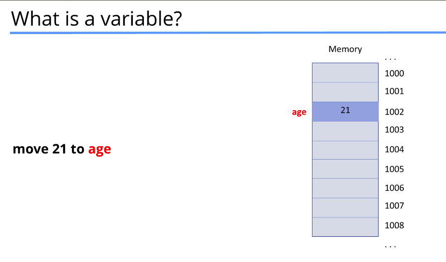

## Section Overview
Variables
- Declaring variables
- C++ primitive types ( int , float , bool, char)
- sizeof operator

Constants
- what is a constant
- declaring constants
- literal constants
- constant expressions

### What is a vairable


```cpp
int age;
double rate;
string name;

Account franks_account;
Person james;
```

### Declaring and initialize variables
```cpp
int age; // uninitialized
int age = 31; // C-like init
int age (21); // Constructor init
int age {21}; // C++11 list init (recommended)

/* Using C++11 list initialization (the curly braces {}) is recommended for several reasons:
1. Prevent uninitialized values
2. avoids Narrowing converstion loss ( let say a float value to an int will raise errors)
3. Unfirom ways to init across different types
```

### Gloabl vs local variables

```cpp
#include <iostream>

using namespace std;

int age {8}; // Global Variable, bad practie

int main() {
    int age {0}; // Local variable , takes priotity.
    return 0;
}
```

### C++ Built in Primitive Types
Fundamental data type implemented directly by the C++ language
| Category           | Types                                                   |
| ------------------ | ------------------------------------------------------- |
| **Character**      | `char`, `signed char`, `unsigned char`                  |
| **Integer**        | `short`, `int`, `long`, `long long` + unsigned versions |
| **Floating-Point** | `float`, `double`, `long double`                        |
| **Boolean**        | `bool`                                                  |

### What is climits give u the size and limits of each types
<climits> and <cfloat> gives you the minimum and maximum values of integer types. 
- INT_MAX
- INT_MIN
- LONG_MAX
- USHRT_MAX (unsigned short)
- CHAR_MAX

Useful when checking limits or avoiding overflow

```
Example:
#include <climits>
#include <cfloat>
cout << INT_MAX;   // largest int
cout << INT_MIN;   // smallest int

sizeof(char)
sizeof(int)
```


### What is a constant
- similar to variables just that their value cannot change once declared

| Type of Constant                       | Description                           | Example                            |
| -------------------------------------- | ------------------------------------- | ---------------------------------- |
| **Literal Constants**                  | Fixed values written directly in code | `10`, `3.14`, `'A'`, `true`, `\n`       |
| **Declared Constants (`const`)**       | Variables whose value cannot change   | `const int x = 5;`                 |
| **Constant Expressions (`constexpr`)** | Evaluated at compile time             | `constexpr int size = 10;`         |
| **Enumerated Constants (`enum`)**      | Named integer constants               | `enum Color { RED, GREEN, BLUE };` |
| **Defined Constants (`#define`)**      | Preprocessor macro constants          | `#define MAX 100`                  |

dont use defined constants in Modern c++ code since it cant typecheck , common in legacy C++
1. No type safety
    #define MAX 100
    The compiler doesn't know the type — it’s just text replacement.
2. No scope
    #define is global everywhere → can cause name collisions.

