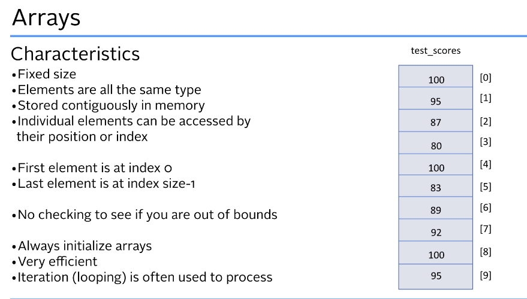
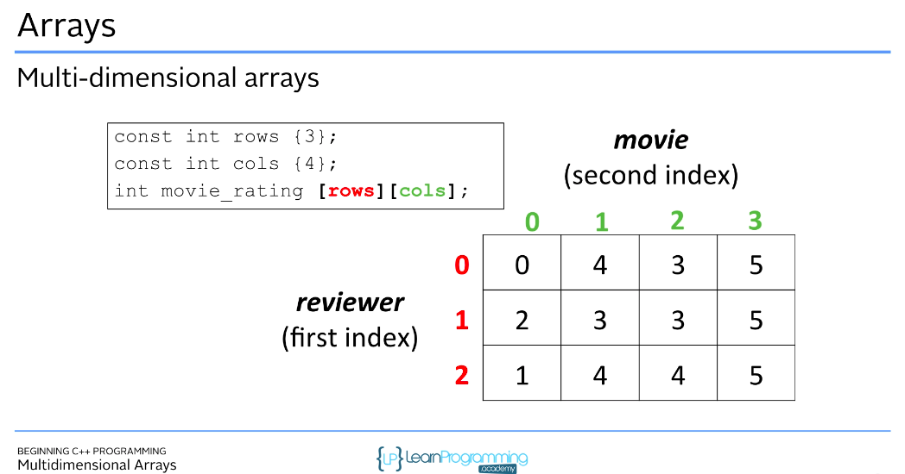

## Section Overview
## What is an Array?



```cpp
int test_scores[5] {100,95,99,87,88};
int high_score_per_level[10] {3,5}; //init to 3,5 and remaining to 0

const int day_in_year {365};
double hi_temperatures[days_in_year] {0}; // init all to zero

int another_array[] {1,2,3,4,5} //size automatically calcualted
```

### Accessing array elements
```cpp
int test_scores[5] {100,95,99,87,88};
test_scores[0] = 90;

char vowels[] {'a','e','i','o','u'}
cout<<'The first vowel is '<<vowels[0]<<endl;
cout<<'The second vowel is '<<vowels[1]<<endl;

cin>>vowels[5];

```

### Multi-Dimensional Arrays

```cpp
const int rows {3};
const int cols {4};
int movie_rating [rows][cols];

int movie_rating [3][4] 
{
    {0,1,3,5},
    {0,1,3,5},
    {0,1,3,5}
};
```
#### ✅ Why modern C++ uses std::vector instead of raw arrays

| Reason                      | Arrays                                      | `std::vector`                          |
| --------------------------- | ------------------------------------------- | -------------------------------------- |
| **Fixed size**              | Size cannot change                          | Can grow/shrink dynamically            |
| **No bounds checking**      | Accessing out of range = undefined behavior | `vector.at()` checks bounds safely     |
| **No size information**     | Must manually track size                    | `vec.size()` always available          |
| **Hard to pass around**     | Arrays decay to pointers → lose size info   | Vectors keep metadata (size, capacity) |
| **No memory management**    | You must manage memory manually             | Vector manages memory automatically    |
| **Not copyable/assignable** | Arrays cannot be assigned directly          | Vectors can be copied, assigned, moved |
| **Safety**                  | Dangerous, easy to overflow                 | Much safer & standard in modern C++    |
| **Supports algorithms**     | Limited compatibility                       | Works with STL algorithms              |


## What is a Vector?
A vector is a dynamic array provided by the C++ Standard Library (std::vector).

Key Features
- Can grow or shrink automatically

| Function         | Purpose                          | Example           |
| ---------------- | -------------------------------- | ----------------- |
| `v.size()`       | Get number of elements           | `v.size()`        |
| `v.push_back(x)` | Add element to end               | `v.push_back(5);` |
| `v.pop_back()`   | Remove last element              | `v.pop_back();`   |
| `v.at(i)`        | Safe access with bounds checking | `v.at(2)`         |
| `v[i]`           | Fast access (no checks)          | `v[0]`            |
| `v.clear()`      | Remove all elements              | `v.clear();`      |
| `v.empty()`      | Check if vector is empty         | `v.empty()`       |
| `v.front()`      | First element                    | `v.front()`       |
| `v.back()`       | Last element                     | `v.back()`        |

### Declaring and init vectors
```cpp
#include <vector>

std::vector<char> vowels (5); //5 chars, all '\0'
std::vector<int> scores (5); //5 int , all 0
std::vector<char> vowels {'a', 'e', 'i', 'o', 'u'};
std::vector<int> scores {10, 20, 30, 40, 50};
```

### Accessing and Modifying Vector Elements
```cpp
vector_name[1000] // no bound checking , faster
vector_name.at(1000) // this has bound checking, safer
vector_name.push_back(80) // adding 80 to the vector , dynamic size
vector_name.size()
```

### 2 dimensional vector
```cpp
# include vector
std::vector<vector<int>> movie_ratings
{
    {1,2,3,4},
    {1,2,3,4},
    {1,3,4,5}
};


```


