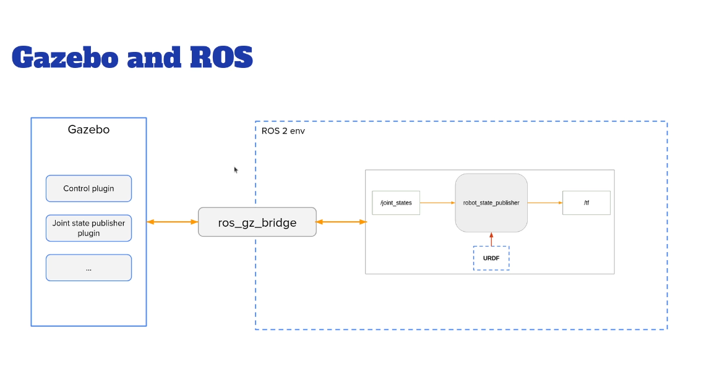

Course: TF | URDF | RVIZ | Gazebo

## Section2: TF ( TransForm) Overview
```
Transformation and RobotModel 

Red X
Green y
blue z

rotationOnX roll 
rotationOnY pitch
rotationOnZ yaw
```

```
ros2 topic list
ros2 topic echo /tf

- header:
    stamp:
      sec: 1756342690
      nanosec: 271753288
    frame_id: gripper_pole
  child_frame_id: right_gripper
  transform:
    translation:
      x: 0.2
      y: -0.01
      z: 0.0
    rotation:
      x: 0.0
      y: 0.0
      z: 0.0
      w: 1.0


ros2 run tf2_tools view_frames
- this generate the image
```


What problesm are we trying to solve with TF?
 - keep a structured tree for all the joints/frames over time
 - how frames are placed relative to on another 
 - how they move relative to each other

 How to compute Transforms
 - we need to keep track of each frame 
 - transform and rotation
 - The ROS TF Functionality 


## Section 3: Create a URDF for a Robot
### 1. Create a URDF File
```
- Description of all the elements in a robot
- Used to generate TFs
- XML format
```

how to assemble 2 parts (links) of the robot with a joint 

### 2. Create ur URDF
URDF Documentation: https://wiki.ros.org/urdf/XML 

Opening the urdf
```
ros2 launch  urdf_tutorial display.launch.py model:=/home/ubuntu/notes/src/my_robot.urdf 

```
#### Adding Visuals
##### Adding Geometry
##### Adding Material
##### Adding Joint
- fixed
- revolute
- continuous
- prismatic

## Section4: Broadcast TFs with the Robot State Publisher
- urdf --urdf_tutorial--> /tf
- urdf --ur_own_package--> / tf

```
ros2 param list /robot_state_publisher
ros2 param get /robot_state_publisher robot_description

ros2 interface show sensor_msgs/msg/JointState
```


```
ros2 run robot_state_publisher robot_state_publisher --ros-args -p robot_description:="$(xacro my_robot.urdf)"

ros2 run joint_state_publisher_gui joint_state_publisher_gui

ros2 run rviz2 rviz2
```


### Create a Robot description Package to install the URDF
```
ros2 pkg create my_robot_description

ros2 launch my_robot_description display.launch.xml
ros2 launch my_robot_description display.launch.py
```
### Adding rviz config
```
ros2 run rviz2 rviz2 -d urdf_config.rviz
```


## Section5: Improve URDF with Xacro

- add variable and function and Macro with Xacro 
- modularizing urdf

```
sudo apt install ros-<distro>-xacro
```
### Using Variables

```xml
<?xml version="1.0"?>
<robot name="my_robot" xmlns:xacro="http://www.ros.org/wiki/xacro">
    
    <xacro:property name="base_link_length" value="0.8" />
    <xacro:property name="base_link_width" value="0.5" />
    <xacro:property name="base_link_height" value="1.0" />
    <xacro:property name="wheel_radius" value="0.1" />
    <xacro:property name="wheel_length" value="0.05" />

    <link name="base_link">
        <visual>
            <geometry>
                <box size="${base_link_length} ${base_link_width} ${base_link_height}" />
            </geometry>
            <origin xyz="0 0 ${base_link_height/2.0}" rpy="0 0 0" />
            <material name="blue" />
        </visual>
    </link>
```

### Using Macros 
```xml
  <xacro:macro name="wheel_link" params="prefix">
      <link name="${prefix}_wheel_link">
          <visual>
              <geometry>
                  <cylinder radius="${wheel_radius}" length="${wheel_length}" />
              </geometry>
              <origin xyz="0 0 0" rpy="${pi/2.0} 0 0" />
              <material name="grey" />
          </visual>
      </link>
  </xacro:macro>
```

### Include a XacroFile into Another Xacro File

## Section 6: Simulate Your Robot with Gazebo
- Understand how gazebo is integrated with ROS
- Adapt the URDF for Gazebo
- Spawn the robot in Gazebo
- Add a Gazebo control plugin
- Create a simulated world for the robot
### Run Gazebo
```
sudo apt install ros-jazzy-ros-gz

gz sim
gz topic -l

ros2 launch ros_gz_sim gz_sim.launch.py gz_args:=/home/ubuntu/notes/GazeboHarmonic/udemy_ws/src/my_robot_description/meshes/my_empty_world.sdf
```
### How Gazebo works with ROS


### Add intertials Tags in the URDF
list of moment of inertia
https://en.wikipedia.org/wiki/List_of_moments_of_inertia

### Add Collision Tags in URDF
### Spawn the Robot in Gazebo
```
ros2 run robot_state_publisher robot_state_publisher --ros-args -p robot_description:="$(xacro src/my_robot_description/urdf/my_robot.urdf.xacro)"

ros2 launch ros_gz_sim gz_sim.launch.py gz_args:="/home/ubuntu/notes/GazeboHarmonic/udemy_ws/src/my_robot_description/meshes/my_empty_world.sdf -r"

ros2 run ros_gz_sim create -topic robot_description 

ros2 run rviz2 rviz2 -d src/my_robot_description/rviz/urdf_config.rviz
```

### Launch File to Start the Robot in Gazebo
- Create a new package "my_robot_bringup"
- Create and install a "launch" folder
- Add a new launch file "my_robot_gazebo.launch.xml"
- In the launch file, start:
  - Robot state publisher node
  - Gazebo launch file ( using <include file="" /> tag and <arg name="" value="" />)
  - create node
  - Rviz2 with config
```bash
ros2 launch my_robot_bringup my_robot_gazebo.launch.xml
```

### Add Gazebo Plugins to Control the Robot
```
gz-sim/src/systems/diff_drive

for 2 wheel drive
.cc
.hh

```
### Set up gazebo bridge

The ros_gz_bridge ... Rostopic mapping to GazeboTopic
https://github.com/gazebosim/ros_gz/tree/ros2/ros_gz_bridge
```bash
gz topic -i -t /clock
gz topic -h
gz topic -l

ros2 topic list
ros2 topic info /clock

# in ur gazebo_bridge.yaml
- ros_topic_name: "/clock"
  gz_topic_name:  "/clock"
  ros_type_name: "rosgraph_msgs/msg/Clock"
  gz_type_name: "gz.msgs.Clock"
  direction: GZ_TO_ROS  #GZ_TO_ROS , ROS_TO_GZ , BIDRECTIONAL
```

### FinalResult
```bash
# Publish ur cmd_vel
ros2 topic info /cmd_vel
ros2 interface show geometry_msgs/msg/Twist
ros2 topic pub -r 1 /cmd_vel geometry_msgs/msg/Twist "{linear: {x: 0.5}, angular: {z: 0.5}}"

# Install teleop twist keyboard
ros2 run teleop_twist_keyboard teleop_twist_keyboard
```

### Creating your own world 
https://gazebosim.org/docs/harmonic/fuel_insert/

## Section 7: 
```bash
# See joint states
ros2 topic echo /joint_states


# Command the lift (5 cm up)
ros2 topic pub -1 /lift/cmd_pos std_msgs/Float64 "data: 0.05"

# Max up (20 cm)
ros2 topic pub -1 /lift/cmd_pos std_msgs/Float64 "data: 0.2"

# Down
ros2 topic pub -1 /lift/cmd_pos std_msgs/Float64 "data: 0.0"
```


# Hookup into RMF 
## Convert into sdf files
```
xacro my_robot.urdf.xacro > my_robot.urdf
gz sdf -p my_robot.urdf > my_robot.sdf

change to model.sdf and model.config
```
### slotcar plugin
Example: navigate
```bash
ros2 topic pub -1 /robot_path_requests rmf_fleet_msgs/msg/PathRequest "fleet_name: 'tinyRobot'
robot_name: 'tinyRobot1'
task_id: '1'
path:
- t: {sec: 0, nanosec: 0}
  x: 234.637
  y: -627.396
  yaw: 0.05417
  level_name: 'L1'
- t: {sec: 0, nanosec: 0}
  x: 265.655
  y: -625.714
  yaw: 0.09064
  level_name: 'L1'"
```
Example: stop
```bash
ros2 topic pub /robot_path_requests rmf_fleet_msgs/msg/PathRequest "fleet_name: 'tinyRobot'
robot_name: 'tinyRobot1'
task_id: '99'
path:
- {t: {sec: 0, nanosec: 0}, x:  cur_x, y:  cur_y, yaw: cur_yaw, level_name: 'L1'}
- {t: {sec: 0, nanosec: 0}, x:  cur_x, y:  cur_y, yaw: cur_yaw, level_name: 'L1'}"
```
robot_mode_requests — rmf_fleet_msgs/msg/ModeRequest
Toggle modes / actions (e.g., attach or detach cart).

Set: fleet_name, robot_name, mode.mode (e.g., RobotMode.MODE_PERFORMING_ACTION, RobotMode.MODE_IDLE), mode.mode_request_id (int), mode.performing_action (string like 'attach_cart' or 'detach_cart').

Example: robot_mode 
```bash
ros2 topic pub /robot_mode_requests rmf_fleet_msgs/msg/ModeRequest "fleet_name: 'FLEET_A'
robot_name: 'TinyRobot'
mode:
  mode: 5
  mode_request_id: 123
  performing_action: 'attach_cart'"
```
*(Replace 5 with the enum for MODE_PERFORMING_ACTION if your CLI supports names; many shells require the numeric value.

)


