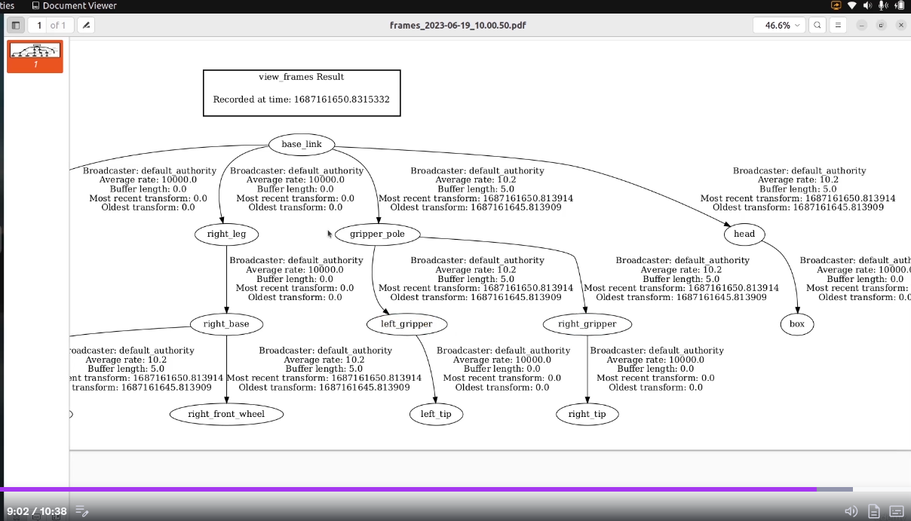
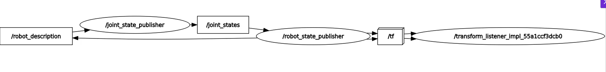
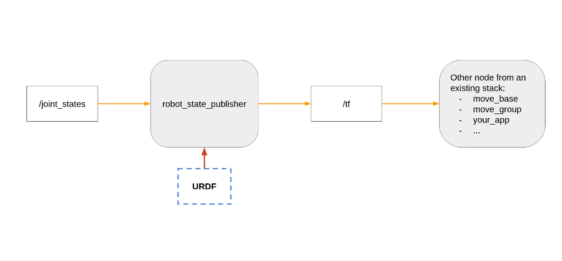

Course: TF | URDF | RVIZ | Gazebo

## Section2: TF ( TransForm) Overview
```
Transformation and RobotModel 

Red X
Green y
blue z

rotationOnX roll 
rotationOnY pitch
rotationOnZ yaw
```

```
ros2 topic list
ros2 topic echo /tf

- header:
    stamp:
      sec: 1756342690
      nanosec: 271753288
    frame_id: gripper_pole
  child_frame_id: right_gripper
  transform:
    translation:
      x: 0.2
      y: -0.01
      z: 0.0
    rotation:
      x: 0.0
      y: 0.0
      z: 0.0
      w: 1.0


ros2 run tf2_tools view_frames
- this generate the image
```



What problesm are we trying to solve with TF?
 - keep a structured tree for all the joints/frames over time
 - how frames are placed relative to on another 
 - how they move relative to each other

 How to compute Transforms
 - we need to keep track of each frame 
 - transform and rotation
 - The ROS TF Functionality 


## Section 3: Create a URDF for a Robot
### 1. Create a URDF File
```
- Description of all the elements in a robot
- Used to generate TFs
- XML format
```

how to assemble 2 parts (links) of the robot with a joint 

### 2. Create ur URDF
URDF Documentation: https://wiki.ros.org/urdf/XML 

Opening the urdf
```
ros2 launch  urdf_tutorial display.launch.py model:=/home/ubuntu/notes/src/my_robot.urdf 

```
#### Adding Visuals
##### Adding Geometry
##### Adding Material
##### Adding Joint
- fixed
- revolute
- continuous
- prismatic

## Section4: Broadcast TFs with the Robot State Publisher
- urdf --urdf_tutorial--> /tf
- urdf --ur_own_package--> / tf

```
ros2 param list /robot_state_publisher
ros2 param get /robot_state_publisher robot_description

ros2 interface show sensor_msgs/msg/JointState
```


```
ros2 run robot_state_publisher robot_state_publisher --ros-args -p robot_description:="$(xacro my_robot.urdf)"

ros2 run joint_state_publisher_gui joint_state_publisher_gui

ros2 run rviz2 rviz2
```


## Create a Robot description Package to install the URDF
```
ros2 pkg create my_robot_description

ros2 launch my_robot_description display.launch.xml
ros2 launch my_robot_description display.launch.py
```
## Adding rviz config
```
ros2 run rviz2 rviz2 -d urdf_config.rviz
```


