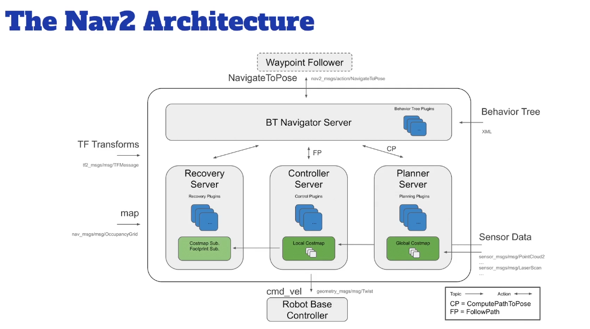
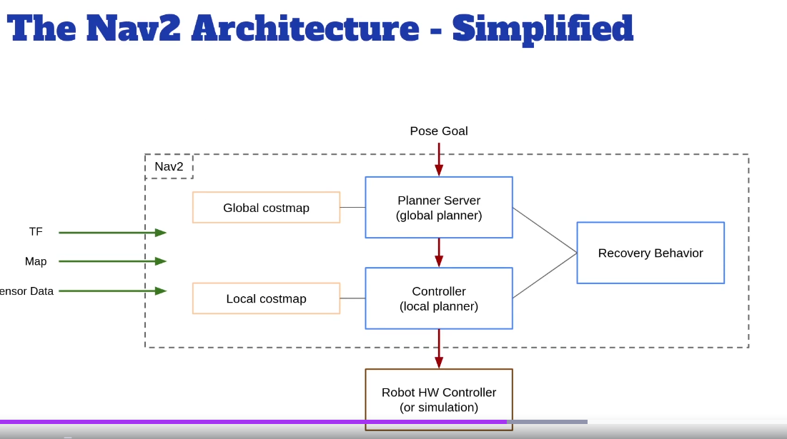

# ROS2 -Nav2 with Slam and Navigation 
### The Navigation2 in ROS2
- Move from pointA to PointB 

1. Create a map ( with Slam)
2. Make the robot navigate from pointA to pointB (nav2)

### Install the Nav2 Stack
```bash
sudo apt update
sudo apt install ros-jazzy-navigation2 ros-jazzy-nav2-bringup
```
### Section3: Generate a Map with SLAM 
Step1: Create a ma[(with SLAM)]
```bash
ros2 launch turtlebot3_gazebo turtlebot3_house.launch.py
ros2 run turtlebot3_teleop teleop_keyboard
ros2 launch turtlebot3_cartographer cartographer.launch.py use_sim_time:=True
ros2 run nav2_map_server map_saver_cli -f ~/notes/Nav2/maps/my_map_house
```

### Section4: Navigation
Start the Nav2 stack with the map
- 2D Pose Estimate
- Nav2Goal
- Waypoint Following & Nav through Pose
```bash
ros2 launch turtlebot3_gazebo turtlebot3_house.launch.py
ros2 launch turtlebot3_navigation2 navigation2.launch.py use_sim_time:=True map:=$HOME/notes/Nav2/maps/my_map_house.yaml
```

#### Section5: Global Planner
- Global Planner, Local Planner and CostMaps
- Important TF Frames
```
Map -> Odom
Odom -> BaseLink
BaseLink -> BaseScan

ros2 run tf2_tools view_frames
```

- NAv2 Architecture



### Section6 Build your own world in gazebo