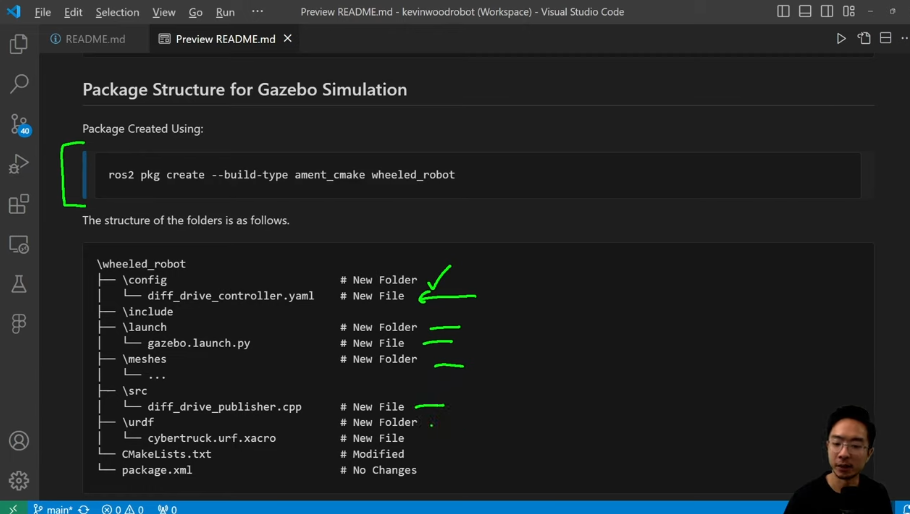

## ROS2 Control, wheeled Mobile robot Gazebo Simulation Diff Drive Controller
https://www.youtube.com/watch?v=8N9elizZ1x4&t=5s

- Gazebo and Ros2 Control Installation 
- Package Structure for Gazebo Simulation
- CmakeList Files updates
- Coordinate Frames 
- UrDf file
- Launch file
- Setup in UrdFile 
- Diff driver for ros2 controller yaml
- Diff driver Commands
- Plot Jugglar for visaualization 

### Package Structure 

### Coordinate Frames for Wheeled Mobile Robot
- Top View
- SideView
