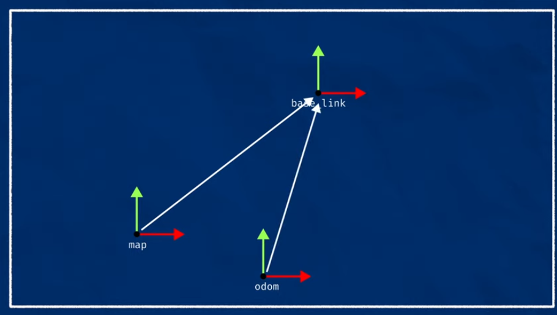

# SLAM 
https://www.youtube.com/watch?v=xqjVTE7QvOg

## Build a Grid Cell Map
- Using either 2d lidar or camera
- To build a grid Cell Map

## Kalman fileter
- Odometry prediction 
- Lidar Observation 
- provides Corrected Pose 

## Frontier Exploration
- Exploring new Frontier to create a map

## Path Finding
- A*PATH will cost slaming in the world 
- CostMap will increase the cost , away from the world 
- Purpursuit Algorithm
- Look ahead distance
- Monte Carlo Localization

# Articualted Robotics
https://www.youtube.com/watch?v=ZaiA3hWaRzE&t=214s
## Intro
- Lidar with Ros2SlamToolBox to create a Map
- Reuse the Map with Nav2 , autonomousaly navigate a safe path
## Making a map of the street
- Take note of the street while u walk 
- Use Map for Localization , can pin point where am i in the global coordinate system 
- localization is not navigation 
## Feature or Grid Mapped Slam ( we will focus on Grid Mapped Slame)

## Robot Frames
### Odom, Baselink

- Odom is smooth and minimal error in small section, it will drift over time
- Odometery effectively measures robot velocity
- This velocity is integrated to estimate position 

### Map Frame, Odom , Baselink

# Slam Tool box
https://github.com/SteveMacenski/slam_toolbox?tab=readme-ov-file

