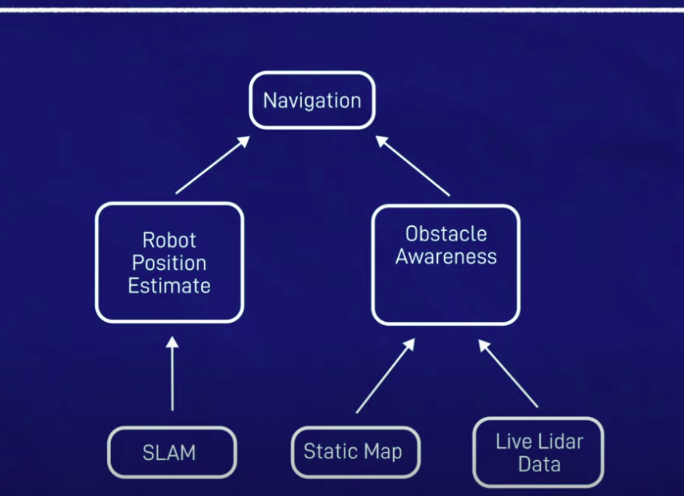

## Making robot navigation easy with Nav2 and Ros
https://www.youtube.com/watch?v=jkoGkAd0GYk&t=379s


### Using Nav2, move from Initial Pose to Target Pose
- Robot Position Estimate <- Slam , (Odmetry not recommended)
- Obstacle Awarness (Costmap) <- Static_Map, Live Lidar Data
- Global Planner and Local Planner


## prep work 
```
ros-jazzy-twist-mux
/cmd_vel_joy
/cmd_vel
```


