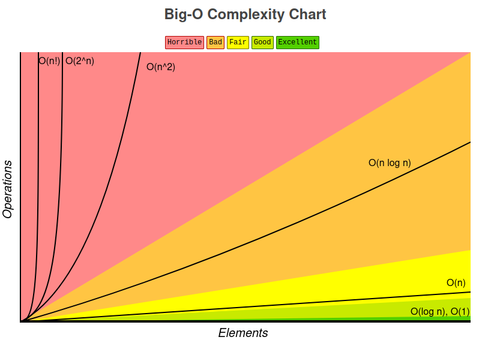
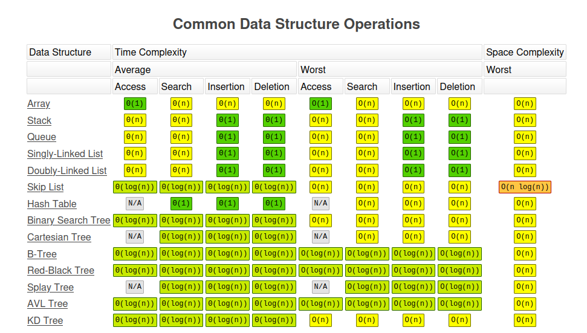
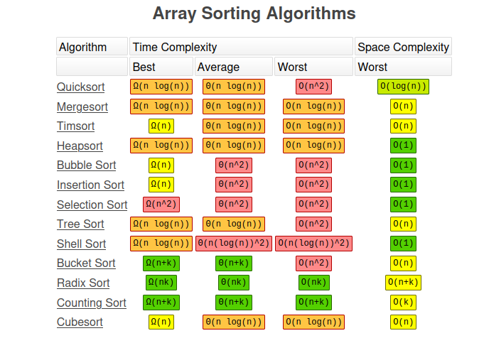
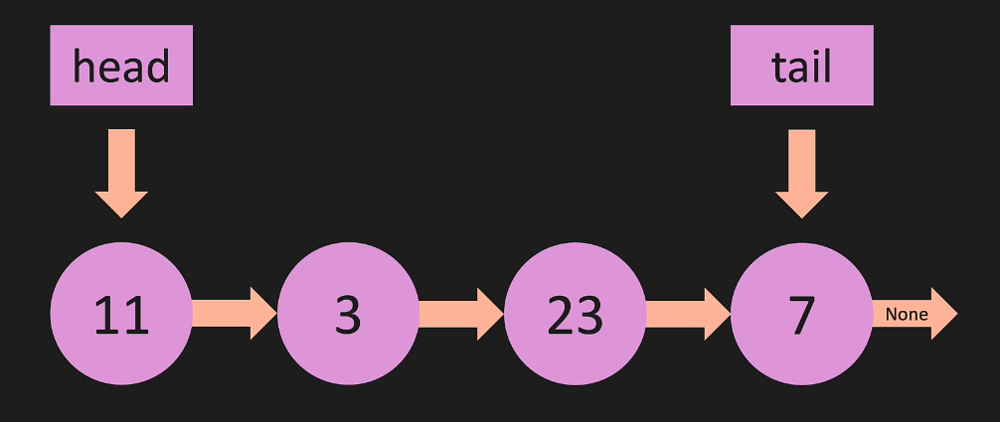
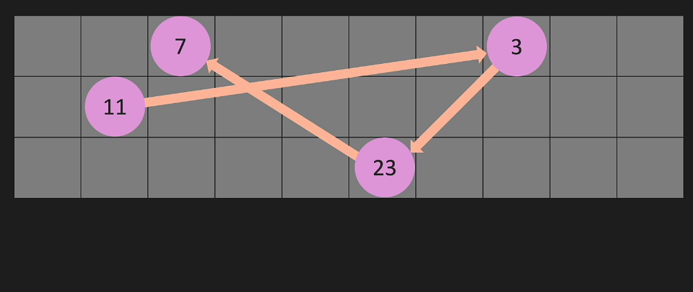
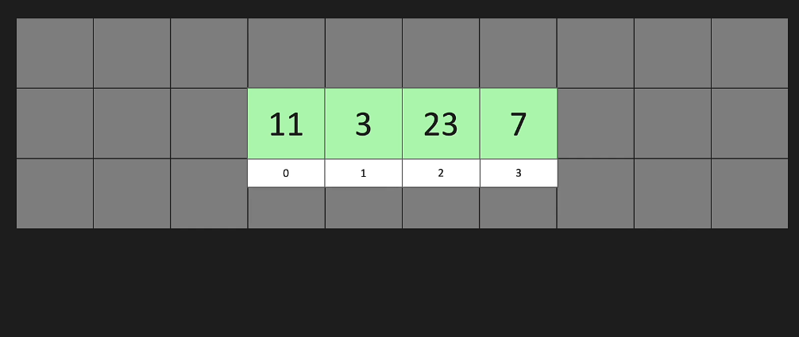
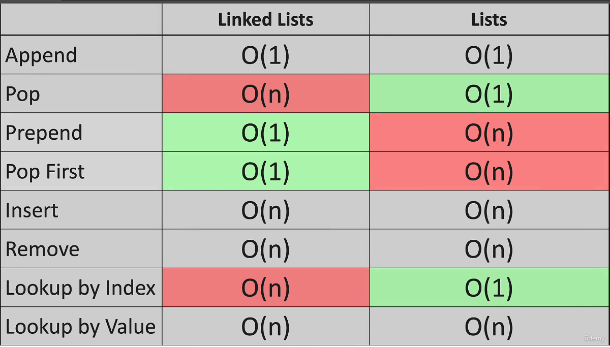

## Section2: BigO
### Big0
- Time Complexity ( Speed Optimised)
- Space Complexity ( Memory Optimised )
### Big0: Worst Case
### Big0: Different Terms for Inputs
o( a * b)
### Big0: Lists
my_list.pop(11)
- 0(n) , removing at the start of the list 
- o(1) , removing at the end of the list
### BigO Cheatsheet,
https://www.bigocheatsheet.com/




## Section3: Classes & Pointers
### Classes
```py
class Cookie:
    def __init__(self, color):
        self.color = color

    def get_color(self):
        return self.color
    def set_color(self,color):
        self.color=color

cookie_one = Cookie('green')
cookie_two = Cookie('blue')
```


## Section4: Linked Lists
head -> tail 
11 3 23 7


- Linked list sits every where but points to each other memory location

- This just a list , it sits beside each other in memory


### LL: BIG O
Addition and Removing of List will be 
- o(1)
- o(n)
- lookup just loop through the index



*notes
For most general-purpose "list" use cases, a Python list (which is actually a dynamic array under the hood, like a C array that resizes) is better than a linked list. But let’s break it down so you see where a linked list can make sense:

##### ✅ LL: Benefits of Linked Lists
1. **Fast Insertions/Deletions in the Middle**
   * In an array (Python `list`), inserting or deleting in the middle requires shifting all the elements after it (O(n)).
   * In a linked list, insertion or deletion is O(1) *if* you already have a reference to the node.
2. **No Reallocation/Resizing**
   * Dynamic arrays occasionally need to resize (allocate new memory, copy elements).
   * Linked lists allocate nodes individually, so no resizing cost.
3. **Memory Flexibility**
   * You don’t need a large contiguous memory block, just enough for each node.
   * Useful in low-level systems with fragmented memory (not really an issue in Python though).
4. **Custom Structures**
   * You can easily build specialized structures (stacks, queues, LRU caches, adjacency lists in graphs) with linked lists as the base.
---

##### ❌ LL: Downsides (Why arrays are usually better in Python)

1. **Poor Cache Locality**
   * Lists in Python store elements in contiguous memory → CPU caches love this.
   * Linked list nodes are scattered in memory → more cache misses, slower iteration.
2. **Extra Memory Overhead**
   * Each node needs a reference (pointer) to the next node, doubling memory usage compared to arrays.
3. **No O(1) Random Access**
   * `my_list[10]` in Python lists is O(1).
   * In linked lists, you must traverse from the head (O(n)).
4. **Python Implementation Reality**
   * Python’s built-in `list` is *highly optimized C code*.
   * Any custom linked list in Python will be much slower for normal list-like tasks.
---

##### 🚀 LL: Practical Takeaway
* **Use `list`** for almost everything (fast indexing, iteration, slicing, appends).
* **Use `deque` (from `collections`)** if you need **fast O(1) appends/pops from both ends**.
* **Use linked lists** only if:
  * You’re learning data structures,
  * You want to implement specialized structures (LRU cache, graph adjacency),
  * Or you're in a low-level language (C, C++) where manual memory control matters.
---

## Section7: Doubly Linked Lists
## Section10: Stacks & Queues
## Section13: Trees
## Section

